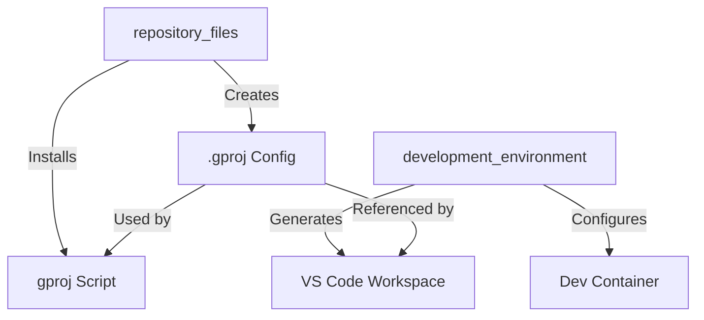
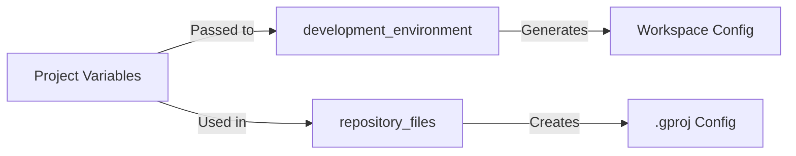

# Module Path Integration

## Component Relationships

## Module Responsibilities

### development_environment
- Extracts org/repo from documentation source URLs
- Constructs workspace folder mappings
- Configures VS Code settings and extensions
- Manages development container setup if enabled

### repository_files
- Generates .gproj configuration
- Manages gproj script installation
- Handles file content templates
- Ensures proper permissions

## Variable Flow

## Testing Requirements

For module testing, ensure:
1. project_prompt is set
2. repo_org is provided
3. project_name is specified

Module tests do not require GitHub Pro features.

## Integration Points

1. **VS Code Workspace ↔ gproj Script**
   - Both use consistent path structures
   - Share documentation organization model
   - Reference same base configuration

2. **.gproj Config ↔ Workspace Config**
   - Documentation paths align
   - Organization structure preserved
   - Settings properly propagated

3. **repository_files ↔ development_environment**
   - Coordinated path generation
   - Consistent variable usage
   - Proper dependency chain